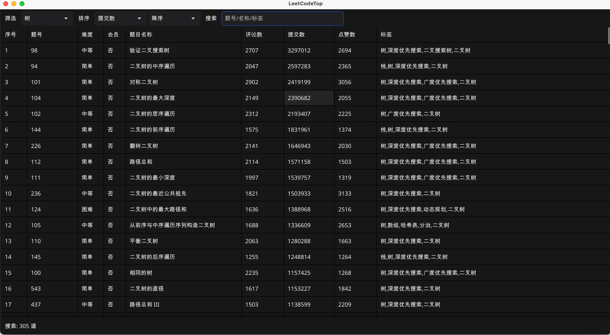

# LeetCodeTop

基于 Golang 实现的 LeetCode 高频题 GUI 工具，支持筛选（题目类型/标签）、排序（评论数、提交数、点赞数）、搜索功能



### 使用

- 自行准备数据  `data/leetcodeTop.example.txt` 
- 配置 Golang 环境和 Fyne 依赖
- 运行 `gui.go`
```bash
go mod tidy
go run gui.go
```

- 本项目采用 [MIT License](LICENSE) 开源协议
