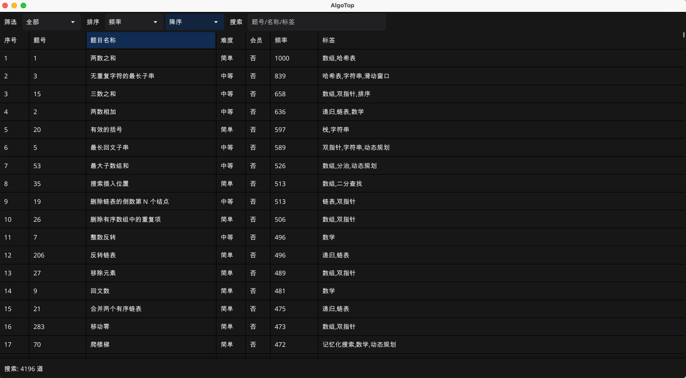

# AlgoTop

基于 Golang 实现的 LeetCode 算法题 GUI 管理工具，支持筛选、排序、搜索功能



### 使用

- 自行准备数据  `data/example.txt`
    ```txt
        题号 | 题目名称 | 难度 | 会员 | 标签 | 频率
        1  | 题目1 | 简单 | 否 | 数组 | 10
    ```
- 配置 Golang 环境和 Fyne 依赖
- 运行 `gui.go`
    ```bash
    go mod tidy
    go run gui.go
    ```

### 声明

- 本项目仅作为算法题的管理工具，仓库提供的 example.txt 为演示使用的模拟数据，使用者需自行负责数据的获取与维护，并确保数据来源符合相关平台的服务条款及法律法规
- 本项目及其衍生数据仅供个人学习，严禁用于任何商业用途

### 许可

[](LICENSE)
[](LICENSE.md)


